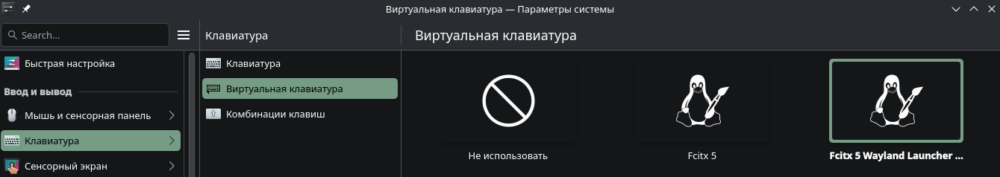

# Fetch!

# Desktop screen!

# Favorites accent color's
#88c0d0
#a0d6b5

# Fcitx5
For Fcitx5 to work properly under Wayland, you need to select the **Fcitx5 Wayland Launcher** input method module.

# Link to wallpapers
[Wallpapers Project](https://github.com/kowareru/wallpapers)
